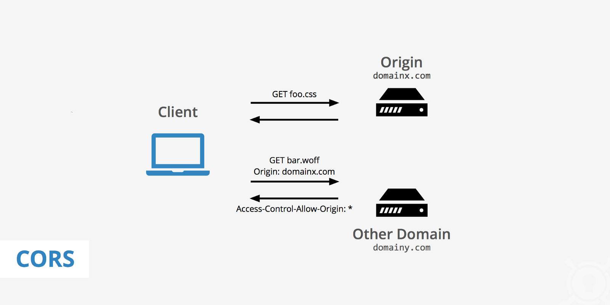
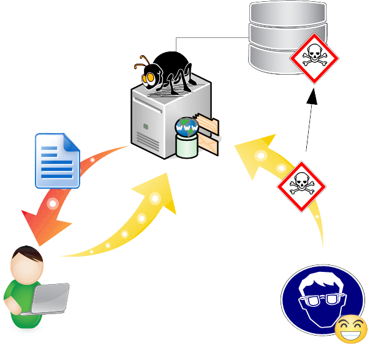
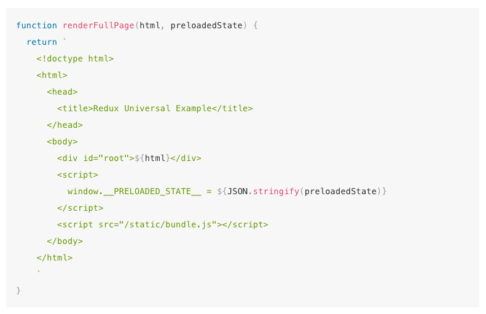
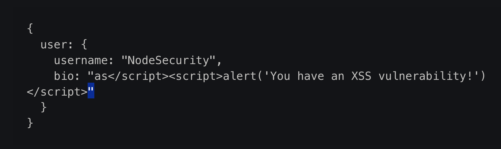

## Development Roundtable:
# CORS and XSS

---
@snap[north-west]
#### CORS and XSS: Why care?
@snapend

@snap[west span-100]
@ul[spaced text-black]
- Cross-site Scripting (XSS) is a common exploit
- Combining the threat of XSS with Cross-origin Resource Sharing has implications
- The threat is not going away and is likely excaberated by the large set of uncontrolled/unaudited dependencies present in typical large javascript projects
@ulend
@snapend

@snap[south span-100]
#### [National Vulnerabilities Database](https://nvd.nist.gov/)
#### [XSS Statistics](https://snyk.io/blog/xss-attacks-the-next-wave/)
@snapend

---
@title[CORS is the Best, Am I Right?]

@snap[north-west]
#### What is Cross-origin Resource Sharing (CORS)?
@snapend

@snap[west span-100]
@quote[Cross-origin resource sharing is a mechanism that allows restricted resources on a web page to be requested from another domain outside the domain from which the first resource was served]
@snapend

@snap[south span-100]
#### [Cross-origin Resource Sharing Wikipedia @fa[external-link]](https://en.wikipedia.org/wiki/Cross-origin_resource_sharing)
@snapend

---
@snap[north-west]
#### What is Cross-origin Resource Sharing (CORS)?
@snapend

@snap[west span-100]

@snapend

---
@snap[north-west]
#### What's an origin?
@snapend

@snap[west span-100]
@ul[spaced text-black]
- @quote[...user-agents group URIs together into protection domains called “origins”. Roughly speaking, two URIs are part of the same origin (i.e., represent the same principal) if they have the same scheme, host, and port...]
- [The Web Origin Concept](https://www.ietf.org/rfc/rfc6454.txt)
@ulend
@snapend

---
@snap[north-west]
#### What is [Same Origin Policy @fa[external-link]](http://en.wikipedia.org/wiki/Same-origin_policy)?
@snapend

@snap[west]
@ul[spaced text-black]
- Cross-domain AJAX requests were not allowed due to their ability to perform requests with malicious data, tailored headers, and non-idempotent request sequences to read and manipulate data
@ulend
@snapend

---
@snap[north-west]
#### Without the same-origin policy a bad actor could take advantage:
@snapend

@snap[west]
@ul[spaced text-black]
- A user visits malicious.com
- The browser allows client-side javascript to make an AJAX request to another domain
- The requested domain happens to be the user's banking provider
@ulend
@snapend

---
@snap[north-west]
#### What is CORS?
@snapend
@snap[west]
@ul[spaced text-black]
- The conventional browser security model prevents HTTP requests from one origin to another
- CORS extends the traditional security model present in web browsers
- By defining a communication protocol that allows involved parties to gather information about each other
@ulend
@snapend

---
@snap[north-west]
#### What is CORS?
@snapend
@snap[west]
@ul[spaced text-black]
- In CORS, this model is extended by allowing the server-application to verify requests’ origins, by adding specific headers to allow the user-agent to verify the policies enforced by the server and including mechanisms to make queries before sending “complex requests”. CORS adds the Origin header in all CORS requests in order to inform the server-side application with data about where the requests are coming from.
@ulend
@snapend

---
@snap[north-west]
#### Why CORS?
@snapend
@snap[west]
@ul[spaced text-black]
- Web developers were coming up with creative ways to request and integrate data from domains outside their control. The W3C decided to step in and attempt to standardize sharing resources.
- While this capability was in fact around for many years, for simple elements, such as images, ECMAScript (JavaScript) code was not allowed to make such requests, mainly due to the same-origin security policy, implemented by all major browsers.
@ulend
@snapend

---
@snap[north-west]
#### What is CORS (frontend)?
@snapend

@snap[west]
@ul[spaced text-black]
- @quote[CORS is a mechanism to enable client-side cross-origin requests. In summary, it allows requests to be identified by their origin, while the server-side application is able to verify security restrictions, informing the browser if a request is permitted.]
@ulend
@snapend

---
@snap[north-west]
#### What is CORS (backend)?
@snapend

@snap[west]
@ul[spaced text-black]
- CORS is a mechanism to allow server-side web applications to expose resources to all or a restricted set of domains.
- The primary mechanism is HTTP request headers.
- A web client tells a web server its source domain using the HTTP request header "Origin".
@ulend
@snapend

---

#### A simple CORS request always contains an origin

```
GET /cors HTTP/1.1
Origin: http://api.bob.com
Host: api.alice.com
Accept-Language: en-US
Connection: keep-alive
User-Agent: Mozilla/5.0...
```

---

#### A CORS response contains HTTP headers with the "Access-Control-" prefix

```
Access-Control-Allow-Origin: http://api.bob.com
Access-Control-Allow-Credentials: true
Content-Type: text/html; charset=utf-8
```

---

@snap[north-west]
#### Why should we understand CORS?
@snapend

@snap[west]
@quote[Due to those facts, we want to highlight the importance of recognizing that a system will have its security level lowered to the lowest level of all applications that include their contents into an aggregated document when facing the assessed vulnerabilities; thus, allowing other domains to use an application as a part of a bigger project is effectively a responsibility transfer.]
@snapend

---

#### What is Cross-site scripting (XSS)?

- An XSS vulnerability is present when a client-side application unwittingly executes malicious script
- Malicious code is injected into a web application from improperly neutralized input
- Most commonly, this is data injected into a backend database and used to dynamically generate a web page or data requested by a client-side application
- The malicious script executes under the same domain as the web server
- The server will see any request by the client as legit and sharing the same session as a trusted user

### [XSS Definition](https://www.owasp.org/index.php/Cross-site_Scripting_(XSS))

---
@snap[north-west]
#### What are the XSS types?
@snapend

@snap[west span-100]
@ul[spaced text-black]
- Type 1: Reflected XSS (or Non-Persistent) - A compromised web site reflects back a malicious script.
- Type 2: Stored XSS (or Persistent) - A poorly sanitized database stores a malicious script. A user-agent executes a script embedded in dynamically generated content.
- Type 0: DOM-Based XSS - A server provides a legit script. The client executes the script provided by a user.
@ulend
@snapend

@snap[south span-100]
[CWE-79 aka XSS Types @fa[external-link]](https://cwe.mitre.org/data/definitions/79.html)
@snapend

---
@title[Simple XSS Example]
@snap[north-west span-100]
#### Enjoy This XSS Type-2 Diagram!
@snapend

@snap[west span-100]

@snapend

---
@title[Simple XSS Example]

@snap[west span-50]

@snapend

@snap[east span-50]

@snapend

---

@snap[north-west]
#### What is OWASP?
@snapend

@snap[west span-100]
@ul[spaced text-black]
- The Open Web Application Security Project (OWASP), an online community, produces freely-available articles, methodologies, documentation, tools, and technologies in the field of web application security
@ulend
@snapend

@snap[south span-100]
[OWASP Wikipedia @fa[external-link]](https://en.wikipedia.org/wiki/OWASP)
@snapend

---

@snap[north-west]
#### What can we do to prevent XSS vulnerabilities (frontend)?
@snapend

- RULE #0 - Never Insert Untrusted Data Except in Allowed Locations
- RULE #1 - HTML Escape Before Inserting Untrusted Data into HTML Element Content
- RULE #2 - Attribute Escape Before Inserting Untrusted Data into HTML Common Attributes
- RULE #3 - JavaScript Escape Before Inserting Untrusted Data into JavaScript Data Values
- RULE #4 - CSS Escape And Strictly Validate Before Inserting Untrusted Data into HTML Style Property Values
- RULE #5 - URL Escape Before Inserting Untrusted Data into HTML URL Parameter Values
- RULE #6 - Sanitize HTML Markup with a Library Designed for the Job
- RULE #7 - Prevent DOM-based XSS

@snap[south span-100]
[OWASP XSS Cheatsheet](https://www.owasp.org/index.php/XSS_%28Cross_Site_Scripting%29_Prevention_Cheat_Sheet)
@snapend

---

#### OWASP XSS Bonus Rules

- Bonus Rule #1: Use HTTPOnly cookie flag
- Bonus Rule #2: Implement Content Security Policy
- Bonus Rule #3: Use an Auto-Escaping Template System
- Bonus Rule #4: Use the X-XSS-Protection Response Header

---

#### RULE 0 - Never Insert Untrusted Data Except in Allowed Locations

```
 <script>...NEVER PUT UNTRUSTED DATA HERE...</script>   directly in a script
 
 <!--...NEVER PUT UNTRUSTED DATA HERE...-->             inside an HTML comment
 
 <div ...NEVER PUT UNTRUSTED DATA HERE...=test />       in an attribute name
 
 <NEVER PUT UNTRUSTED DATA HERE... href="/test" />   in a tag name
 
 <style>...NEVER PUT UNTRUSTED DATA HERE...</style>   directly in CSS
```

---

@snap[north-west]
#### What can we do to prevent XSS vulnerabilities (backend)?
@snapend

@snap[west span-100]
@ul[spaced text-black]
- Audit dependencies
- Use most up-to-date packages for critical dependencies
- Be sure input to database is sanitized
- Only allow CORS to frontend
- @quote[For these reasons, the server-side application is ultimately responsible for enforcing its security policies for every resource. Additionally, in no circumstance the origin should be used in security controls as the only authentication/security mechanism, if they are judged to be necessary.]
@ulend
@snapend

---

@snap[north-west]
#### What can we do to prevent XSS vulnerabilities (qa)?
@snapend

@snap[west span-100]
@ul[spaced text-black]
- [Testing for Reflected Cross-site Scripting] (https://www.owasp.org/index.php/Testing_for_Reflected_Cross_site_scripting_(OWASP-DV-001))
- [Testing for Stored Cross-site scripting]
(https://www.owasp.org/index.php/Testing_for_Stored_Cross_site_scripting_(OWASP-DV-002))
- [Testing for DOM-based Cross-site scripting]
(https://www.owasp.org/index.php/Testing_for_DOM-based_Cross_site_scripting_(OWASP-DV-003))
@ulend
@snapend

@snap[south span-100]
#### [OWASP Testing Guide](https://www.owasp.org/index.php/OWASP_Testing_Guide_v4_Table_of_Contents)
@snapend

---

#### References
- [CORS and well-known vulnerabilities](https://www.e-systems.tech/est-framework/-/knowledge_base/cors/cors)
- [OWASP CORS Header Scrutiny](https://www.owasp.org/index.php/CORS_OriginHeaderScrutiny)
- [OWASP ASVS](https://www.owasp.org/index.php/Category:OWASP_Application_Security_Verification_Standard_Project)
- [OWASP Cheatsheet](https://www.owasp.org/index.php/OWASP_Cheat_Sheet_Series)
- [OWASP Proactive Controls for Developers](https://www.owasp.org/index.php/OWASP_Proactive_Controls)
- [Most Common XSS Vulnerability React](https://medium.com/node-security/the-most-common-xss-vulnerability-in-react-js-applications-2bdffbcc1fa0)